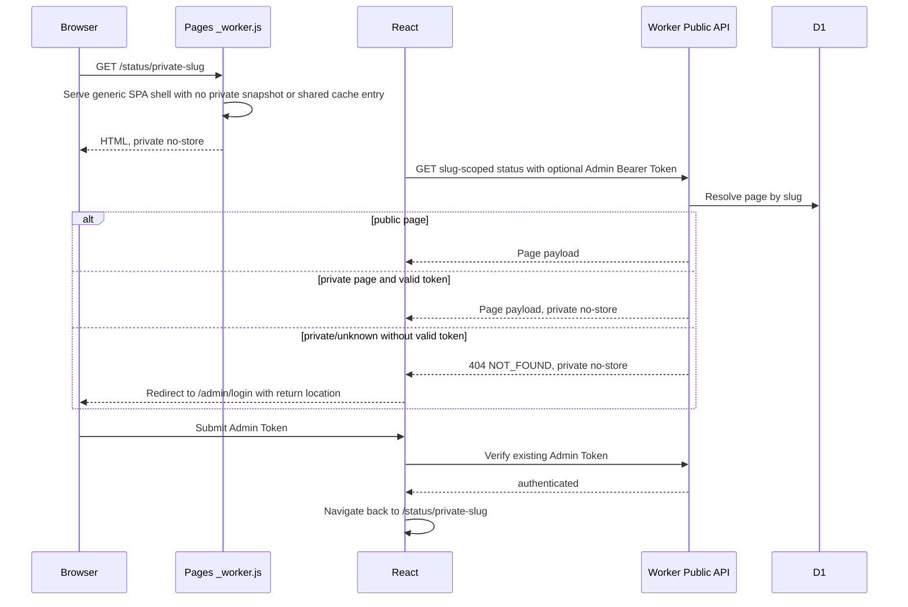

# Spec: Private Status Page Administrator Access

## Task

Allow an authenticated administrator to view a status page with `is_public = false` through the platform-host `/status/:slug` route, while anonymous requests remain indistinguishable from an unknown page.

## Output Language

Human-readable prose is English. Paths, schema fields, API names, commands, identifiers, and canonical terms remain literal.

## Design-depth classification

High risk. The change crosses an authorization boundary, Worker route resolution, Pages HTML caching, React routing, browser credential storage, and every slug-scoped Public API used by status, history, detail, and analytics views. This Spec is the single Technical Design baseline.

## Confirmed scope

- A valid existing Admin Bearer Token authorizes access to `is_public = false` status pages.
- Private pages are accessible only on platform/default hosts through `/status/:slug` and matching slug-scoped API routes.
- Missing or invalid authorization returns the same no-store `404 NOT_FOUND` used for unknown status pages.
- Every authorized private-page HTML and API response is `Cache-Control: private, no-store` and varies on `Authorization` where applicable.
- The existing `/admin/login` flow accepts a private status-page return location and navigates back after successful verification.
- Status, incident history/detail, maintenance history, monitor latency, uptime, outage, day-context, and uptime-overview reads preserve the same authorized page identity.

## Non-goals

- Private-page access through `custom_hostname`; a page set private is unresolved by the existing public Host resolver and its custom hostname returns no-store `404`.
- External visitor passwords, share links, page-level tokens, sessions, RBAC, or SSO.
- Passing credentials in a URL, query parameter, or fragment.
- Changing Admin Token storage, rotation, or the single-administrator product model.
- Hiding selected monitors independently of status-page privacy.

## Technical Design

### Authorization-aware page resolution

Replace the public-only assumption at the slug-scoped route boundary with one shared resolver contract:

- validate the slug exactly as today;
- query the page by slug without exposing it yet;
- return public pages without requiring authorization;
- return private pages only when `hasValidAdminTokenRequest()` succeeds;
- otherwise throw the same `AppError(404, 'NOT_FOUND', 'Status page not found')` as an unknown slug.

The resolver must return whether the page requires private response handling. Every slug-scoped endpoint consumes this resolved access result rather than independently deciding visibility. Page identity remains the existing numeric `status_pages.id` plus slug; no alternate identity or credential table is introduced.

The Host resolver remains public-only (`is_public = 1`). This preserves the current custom-domain trust boundary and makes private custom hostnames fail closed without exposing their ownership.

### Request and browser flow

Pages must not fetch or inject a private page snapshot into navigation HTML because navigation requests do not carry the Admin Token stored in `localStorage`. For a platform-host `/status/:slug` navigation, Pages may continue optimized injection only when the upstream page is public. A `404` from the page-scoped artifact/status request must result in a generic SPA shell marked `private, no-store`, never a shared cached HTML fallback for that slug. React then performs the authenticated API request and owns the login redirect decision.

### Frontend access gate

The status page route uses a private-page-aware gate rather than globally protecting all status pages:

1. Existing public pages render anonymously as before.
2. If a slug-scoped initial data request returns `404` and no verified Admin Token exists, navigate to `/admin/login` with the full safe same-origin return location (`pathname`, `search`, and `hash`).
3. If a stored token exists, verify it once through the existing `AuthContext`; after verification, retry/reset the slug-qualified public queries.
4. If verification fails, clear the token and redirect to login.
5. After login, navigate back to the recorded status page and let the existing API client attach `Authorization`.

The return target must be an internal location object produced by React Router, not a user-supplied absolute URL, preventing open redirects.

### API and cache invariants

1. Public pages preserve current shared snapshot and cache behavior for anonymous requests.
2. A valid Admin Token may read a private slug but never turns the private result into a shared snapshot, edge cache, memory cache, or persisted `localStorage` public snapshot.
3. Private responses use `Cache-Control: private, no-store` and `Vary: Authorization`; private errors use the same policy.
4. Authorized private reads may compute from D1 or read page-qualified data only when the stored artifact cannot have been exposed through the public cache path. If existing page snapshots are used, response handling must still prevent all shared/browser persistence.
5. Logout resets all auth-sensitive public Query keys so private data disappears from the active UI.
6. A private slug cannot be unlocked by query input, forwarding headers, custom Host ownership, or cached public data.
7. Non-page-scoped `/api/v1/public/*` behavior remains unchanged; Admin authorization there may continue to include hidden monitors under the existing contract.

### Failure behavior

- Private and unknown pages are externally indistinguishable: both return `404 NOT_FOUND` without authorization.
- Missing `ADMIN_TOKEN` never makes a private page public.
- If Pages cannot establish that HTML is public, it serves only a generic no-store SPA shell; it does not serve stale page-branded HTML.
- If an authenticated private API request fails, the frontend shows the existing API error behavior after credential verification; it must not fall back to anonymous persisted snapshots.

## Contract surface

- `apps/worker/src/public/status-page.ts`
- `apps/worker/src/routes/public.ts`
- `apps/worker/src/routes/public-ui-analytics.ts`
- `apps/worker/src/middleware/auth.ts`
- `apps/web/public/_worker.js`
- `apps/web/src/app/{router,AuthContext,ProtectedRoute}.tsx`
- `apps/web/src/pages/{StatusPage,IncidentHistoryPage,MaintenanceHistoryPage,AdminLogin}.tsx`
- `apps/web/src/api/client.ts`
- Worker route tests, Pages worker tests, and Web route/auth tests covering slug-scoped status pages

## Compatibility and interruption recovery

- No D1 migration or persisted shape changes are required; existing `is_public` values retain their current meaning for anonymous traffic.
- Public pages, default `/`, Admin routes, and public custom-host routing remain backward compatible.
- If execution stops after Worker authorization support, private APIs remain inaccessible unless a valid Admin Token is already sent manually; the UI still fails closed.
- If execution stops after frontend routing but before Pages cache hardening, do not deploy the partial slice. Worker, Pages, and Web changes form one release unit because private HTML cache safety is mandatory.
- Rollback reverts the Worker resolver/routes, Pages worker, and Web access gate together. No data rollback is needed.

## Security considerations

- Reuse constant product behavior through `hasValidAdminTokenRequest()`; do not create a second token comparison path.
- Return `404`, not `401` or `403`, for unauthorized private slugs to avoid existence disclosure.
- Never put Admin Token in URLs, HTML, bootstrap data, cookies, D1, logs, or cache keys.
- Never forward sensitive headers to an untrusted API origin; retain the existing Pages proxy allowlist behavior.
- Prevent open redirects by accepting only React Router's same-origin location state as the post-login destination.
- Treat response caching and persisted browser snapshots as part of the authorization boundary, not only an optimization detail.

## Acceptance criteria

1. An administrator with a valid stored Admin Token can open a private platform-host `/status/:slug` page and navigate its status, incident, maintenance, monitor detail, and analytics views.
2. Anonymous and invalid-token requests to a private slug receive the same no-store `404` contract as an unknown slug across every slug-scoped endpoint.
3. Public pages retain anonymous shared-cache behavior and existing slug/default/custom-host compatibility.
4. Private HTML and API responses never enter shared edge caches, public memory caches, or persisted browser snapshot caches; logout removes active private query data.
5. `/admin/login` returns safely to the original private path after successful token verification without accepting an external redirect target.
6. A private page's `custom_hostname` remains inaccessible and fail-closed; custom-domain access is explicitly deferred.
7. Focused Worker, Pages, and Web tests plus workspace lint, typecheck, and test commands pass, and browser verification proves login-return, logout, refresh, deep-link, and two-page cache isolation behavior.
