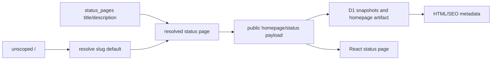

# Spec: Status-page branding ownership

## Task

Make each `status_pages` row the only source of public status-page `title` and `description`. Bind the default `/` experience to the existing `default` status page, and retire the legacy global `settings.site_title` and `settings.site_description` fields from storage, APIs, snapshots, and Admin UI.

## Output Language

Human-readable prose is English. Paths, schema fields, API names, commands, identifiers, and canonical terms remain literal.

## Problem

Uptimer currently has two branding owners: global `settings.site_title` / `settings.site_description` and per-page `status_pages.title` / `status_pages.description`. Slug-scoped responses already expose status-page metadata, but public homepage/status payloads, static HTML metadata, React rendering, and snapshot guards still consume the global fields. Admin users can therefore configure conflicting values with no clear precedence.

## Confirmed decisions

- `status_pages.title` and `status_pages.description` are authoritative for all public page rendering and metadata.
- The unscoped `/` compatibility experience resolves the existing `status_pages.slug = 'default'` row and uses its branding.
- A new append-only D1 migration deletes the legacy `site_title` and `site_description` rows from `settings`.
- Settings API types, validation, Admin UI, snapshot contracts, and guard state stop reading or writing the retired keys.
- `site_locale`, `site_timezone`, retention, state-machine defaults, Admin ranges, and `uptime_rating_level` remain global settings.
- Admin shell document titles use the fixed product name `Uptimer`; they do not borrow a public status-page title.

## Technical Design

### Ownership and flow

Both scoped and unscoped public entry points must resolve a concrete `PublicStatusPage`. Payload builders receive that page identity and copy its `title` and `description` into the existing public response fields, or rename those fields only if doing so does not widen compatibility risk. The key invariant is value ownership, not a cosmetic field rename.

Snapshot freshness and guard comparisons must include the resolved page branding from `status_pages`, because editing a page must invalidate and republish its status/homepage/artifact output. They must no longer query the two retired settings keys. Existing page-qualified snapshot keys remain unchanged.

### Default page compatibility

The migration `0014_status_pages.sql` already creates the deterministic `default` page. Unscoped public routes and `/` must resolve that row rather than synthesize global branding. If the default page is missing or non-public, return the established unavailable/not-found behavior; never fall back to deleted settings or another status page.

### Settings retirement

A new migration deletes only:

- `settings.key = 'site_title'`
- `settings.key = 'site_description'`

The migration is idempotent and does not alter `status_pages`. Existing migration files remain untouched. Runtime Settings schemas and response types remove both properties, so stale clients attempting to patch them receive the existing strict `INVALID_ARGUMENT` response.

### Compatibility and rollback

This is an intentional Admin Settings API contract removal. Public payload field names may remain `site_title` and `site_description` temporarily to minimize consumer churn, but their values must come exclusively from the resolved status page. Rollback requires deploying the previous Worker/Web pair and restoring the two settings rows from backup if the old code still requires them; no applied migration is edited.

### Failure behavior

- Missing/non-public default page: fail safely; do not select an arbitrary page.
- Missing scoped page: preserve `NOT_FOUND`.
- Status-page branding edit: enqueue the existing page-scoped refresh and do not expose another page's snapshot.
- Stale legacy settings rows from an environment that missed migration: runtime ignores them.

## Contract surface

- `apps/worker/migrations/` and migration tests
- `apps/worker/src/settings.ts`, `apps/worker/src/schemas/settings.ts`, and Admin settings routes/tests
- `apps/worker/src/public/`, `apps/worker/src/snapshots/`, and `apps/worker/src/internal/` branding/snapshot paths
- Public stored/runtime Zod schemas and API response types
- `apps/web/src/pages/AdminDashboard.tsx`, `apps/web/src/pages/StatusPage.tsx`, `apps/web/src/api/types.ts`, and i18n labels
- `apps/web/public/_worker.js` HTML metadata injection

## Acceptance criteria

1. `/status/:slug` header, browser title, public JSON branding, homepage artifact, SEO description, Open Graph, and Twitter metadata all use that status page's `title` and `description`.
2. `/` resolves the `default` status page and uses exactly the same branding flow.
3. Two pages with conflicting branding cannot leak title or description through D1 snapshots, Worker/Pages HTML, browser state, or React Query caches.
4. Admin global settings no longer display, return, accept, cache, or refresh `site_title` and `site_description`.
5. A new migration removes only the two retired settings rows while preserving status-page branding and all remaining settings.
6. Editing a status page republishes its page-qualified status/homepage/artifact outputs.
7. Focused Worker tests, web lint/typecheck, full workspace tests, local migration, and browser checks pass.

## Non-goals

- Per-page locale, timezone, theme, logo, favicon, or custom domain.
- Renaming `status_pages.name`, changing slug semantics, or adding another default-page selector.
- Removing the public response field names solely for naming purity when retaining them avoids unnecessary compatibility work.
