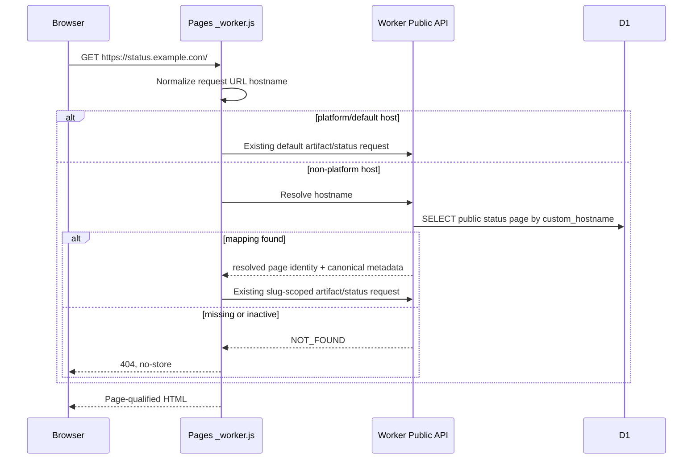

# Spec: Status-page-custom-domains

## Task

Allow each public status page to use one manually provisioned custom hostname while preserving `/status/:slug`, the existing resolved page identity, and page-qualified cache isolation. Cloudflare remains responsible for DNS, Pages domain association, and TLS; Uptimer owns only validated hostname persistence and request routing.

## Output Language

Human-readable prose is English. Paths, schema fields, API names, commands, identifiers, and canonical terms remain literal.

## Design-depth classification

High risk. The change crosses persisted D1 state, Admin and Public API contracts, the Pages edge proxy, React routing, HTML metadata, multiple cache layers, and a Host trust boundary. This Spec is the single Technical Design baseline.

## Confirmed scope

- Each `status_pages` row may own zero or one `custom_hostname`.
- A normalized non-null hostname is globally unique.
- An administrator manually associates the hostname with the Cloudflare Pages project and configures DNS/TLS outside Uptimer.
- Pages resolves a non-platform request hostname to one public status page before serving cached HTML or proxying Public API traffic.
- Host-resolved requests reuse the existing status-page slug/page-ID flow; they do not create a second identity system.
- `/status/:slug` remains available and is not forcibly redirected in this slice.
- A bound custom hostname is the preferred canonical URL for its status page.

## Non-goals

- Calling the Cloudflare API or storing a Cloudflare API Token.
- Creating or changing DNS records, Pages Custom Domains, or TLS certificates.
- Polling certificate or domain verification state.
- Multiple aliases per status page, wildcard hostnames, or apex/`www` redirect policy.
- Tenant isolation, RBAC, per-page credentials, or a new Cloudflare service.
- Automatically proving DNS ownership inside Uptimer.

## Technical Design

### Persisted ownership

Add an append-only migration that introduces nullable `status_pages.custom_hostname` and a unique partial index for non-null values. Persist only a canonical ASCII hostname: lowercase, no trailing dot, no scheme, path, query, fragment, port, wildcard, IP literal, or local/reserved deployment hostname. IDNs are accepted only in their normalized punycode form.

The Admin status-page create/patch/list contracts expose `custom_hostname: string | null`. Empty input clears the binding. Validation happens with Zod before any D1 write, and uniqueness conflicts use the existing `CONFLICT` error shape. Existing rows migrate with `NULL`, so slug behavior and current deployments remain unchanged.

### Platform-host compatibility

Pages needs an explicit set of platform/default hosts that retain existing unscoped behavior. `UPTIMER_DEFAULT_HOSTS` is a normalized comma-separated Pages environment value; deployment automation supplies the project `*.pages.dev` hostname, and operators may add an existing default custom hostname during migration. Local development hosts remain allowed only in local mode.

If this setting is absent, Pages stays in legacy default-host mode and custom-host routing is not considered enabled. Documentation must require configuring the allowlist before enabling a status-page hostname. In enabled mode:

- a host in `UPTIMER_DEFAULT_HOSTS` retains `/` and unscoped Public API default-page behavior;
- a host bound to a public status page resolves to that page;
- any other host fails closed with `404` and `Cache-Control: no-store`;
- `X-Forwarded-Host` and other client-supplied forwarding headers are ignored.

### Host resolution contract

Add a narrow Public API resolver that accepts one validated normalized hostname and returns only routing-safe public metadata for an active public page: page ID, slug, custom hostname, title, description, and generated/canonical metadata needed by Pages. It returns `NOT_FOUND` for unknown, cleared, or non-public mappings. The route uses a parameterized D1 query and does not expose Admin-only configuration.

Pages performs this resolution for every non-platform HTML navigation before any HTML cache hit and for every non-platform proxied Public API request before path rewriting. The initial slice deliberately does not cache Host ownership: binding, replacement, clearing, and page visibility changes therefore take effect on the next request without a stale ownership window. Existing page-qualified status snapshots still serve the resolved page after ownership is established.

### Request flow

For custom-host Public API traffic, Pages resolves the Host and rewrites only unscoped Public API paths to the equivalent existing slug-scoped path before proxying. A custom host cannot access Admin or Internal API routes, and a conflicting `/status/:other-slug` path cannot override Host ownership. The resolved slug is injected into the SPA bootstrap so root and unscoped history routes use the existing `StatusPageSlugContext`, API path builders, React Query keys, memory cache keys, and localStorage keys.

### Cache and canonical invariants

1. Host ownership is resolved before reading a custom-host HTML cache entry.
2. HTML cache keys include normalized origin/Host and resolved page identity; status snapshot keys continue to use numeric page identity.
3. Unknown-host and ownership-conflict responses are `no-store` and are never stale fallbacks.
4. A raw Host never becomes a D1 snapshot key or page ID.
5. A Host-resolved slug cannot be overridden by URL slug, query data, forwarding headers, or browser cache state.
6. Custom-domain HTML uses `https://<custom_hostname>/` as `<link rel="canonical">` and `og:url`; the standard slug URL remains directly usable.
7. Clearing or replacing a binding prevents the old Host from reaching the prior page on the next ownership resolution, even if an old HTML cache entry exists.

### Admin experience and deployment documentation

The existing status-page form gains an optional Custom hostname field. It displays the canonical hostname only, links to the resulting HTTPS URL when configured, and explains that Cloudflare Pages domain association and DNS/TLS setup are manual prerequisites. Documentation covers:

- associating the domain in the Pages dashboard before adding DNS;
- CNAME setup for externally managed subdomains;
- Cloudflare-zone requirements for apex domains;
- `UPTIMER_DEFAULT_HOSTS` compatibility setup;
- safe binding order, verification, clearing, and rollback;
- the fact that Uptimer does not report certificate readiness.

## Contract surface

- `apps/worker/migrations/` and `packages/db/src/schema.ts`
- `apps/worker/src/schemas/status-pages.ts`
- `apps/worker/src/routes/admin-status-pages.ts` and `apps/worker/src/routes/public.ts`
- `apps/worker/src/public/status-page.ts`
- `apps/web/public/_worker.js`
- `apps/web/src/app/{router,StatusPageSlugContext}.tsx`
- `apps/web/src/api/{client,types}.ts`
- `apps/web/src/pages/AdminDashboard.tsx` and status-page form/i18n resources
- `.github/workflows/deploy.yml` and custom-domain deployment documentation

## Compatibility and interruption recovery

- Existing rows retain `custom_hostname = NULL`; existing slug routes and default endpoints remain authoritative until custom-host routing is explicitly enabled.
- The migration is additive and is never edited after application. Rolling back application code leaves an unused nullable column and index.
- If execution stops after persistence work, no Host routing changes occur. If it stops after Pages routing but before UI/docs, Admin API and direct D1/API configuration remain reversible.
- Worker and Pages routing changes deploy as one release unit. On routing failure, disable custom-host routing or roll both deployments back while retaining the additive schema.
- A later `imm-work` run resumes from the first unclosed Step and must not infer that a persisted hostname is live until the Pages routing Step passes.

## Security and failure behavior

- Trust `new URL(request.url).hostname`, not `Host` string parsing or forwarding headers.
- Normalize before lookup and uniqueness checks.
- Unknown, inactive, conflicting, malformed, and reserved hosts fail closed.
- Custom hosts cannot expose Admin/Internal routes or forward sensitive headers to an untrusted API origin.
- Resolver failure never falls back to the default page or another page's cached HTML.
- A manually configured hostname is not proof of certificate readiness; operational errors remain visible rather than being represented as active TLS state.

## Acceptance criteria

1. Admin API and UI can set, replace, list, and clear one validated unique `custom_hostname` per status page without affecting monitor/event publication links.
2. Two custom hostnames bound to two pages always return their assigned page across HTML, status/history/detail UI, Public API, metadata, snapshot reads, React Query, memory cache, and localStorage after warming both orders.
3. Unknown, inactive, cleared, reserved, malformed, and conflicting hosts return a no-store error and never render `default` or a stale prior owner.
4. Platform/default hosts and `/status/:slug` preserve existing behavior; an explicitly configured custom hostname becomes canonical without forcing a slug redirect.
5. Binding replacement or clearing takes effect on the next Host ownership resolution despite an existing HTML cache entry.
6. Focused migration/schema/Admin/Public/Pages tests, workspace lint/typecheck/tests, local migration, Pages-runtime browser checks, and affected-path CPU/parity checks pass.
7. English and Chinese deployment documentation explain the manual Cloudflare Pages, DNS, TLS, allowlist, rollback, and troubleshooting flow without requesting a Cloudflare API Token.
